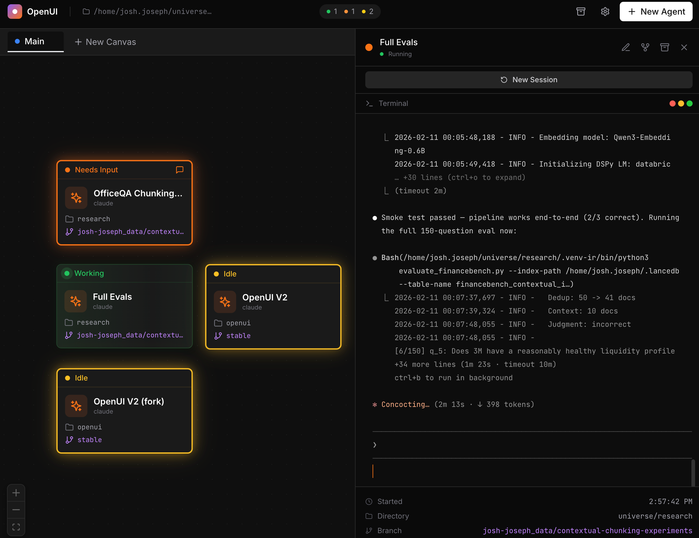

# OpenUI — The AI Agent Command Center

**Run dozens of Claude Code agents in parallel, each in its own isolated environment, all from a single visual dashboard.**

OpenUI turns Claude Code from a single-terminal tool into a full orchestration platform. Spawn agents, assign them tasks, and watch them work side-by-side on an infinite canvas.

---



## Why OpenUI

**Without OpenUI**, running multiple Claude Code agents means juggling terminal tabs, manually tracking when agents need attention, losing context when sessions disconnect, and restarting everything after a reboot.

**With OpenUI**, you open one browser tab and see all your agents at a glance - their status, their branch, current directory — with full terminal access one click away.

---

## Core Features

### Multi-Agent Visual Canvas
Agents are displayed as live cards on a ReactFlow infinite canvas. Each card shows real-time status (working, needs input, idle, error), the current tool being used, git branch, and working directory. Pan, zoom, and drag to organize your workspace however you want.

### Multiple Workspaces
Create separate canvas tabs for different projects or workflows — keep your frontend agents separate from your backend agents, or organize by feature.

### Git Worktree Isolation
Each agent can get its own git worktree automatically. When you assign a branch, OpenUI creates an isolated working directory so agents never step on each other's changes. No merge conflicts between parallel agents.

### Session Persistence & Auto-Resume
Close OpenUI, reboot your machine, come back — all your agents resume exactly where they left off. Terminal history is preserved, session metadata is saved, and agents automatically restart on launch.

### Real-Time Status via Plugin Hooks
A Claude Code plugin reports agent status through lifecycle hooks. You see exactly when an agent is thinking, using a tool, waiting for input, or idle — without parsing terminal output.

### Full Terminal Access
Click any agent card to open its full xterm.js terminal in a sidebar. Bidirectional I/O, ANSI color support, clickable links, 10K line scrollback. Type directly to any agent at any time.

### Conversation Search & Resume
Full-text search across all your Claude Code conversation history using SQLite FTS5. Find a conversation from last week, resume it on a new agent, or fork it to try a different approach.

### GitHub Issue Integration
Browse and link GitHub issues directly from the new agent modal. Issues can auto-generate branch names, and the linked issue number and title display on the agent card.

### Batch Agent Spawning
Spin up 1-20 agents at once. OpenUI queues their startup to avoid OAuth port conflicts and positions them automatically on the canvas.

### Smart Permission & Long-Task Detection
The server detects when an agent is waiting for permission approval and (upcoming) flags tools running longer than 5 minutes - so you know which agents need attention at a glance.

### Self-Updating
OpenUI auto-updates on startup via git pull. Choose between `stable` and `beta` update channels in settings.

---

## Getting Started

### Prerequisites
- **Bun** (v1.0+) - Install with: `curl -fsSL https://bun.sh/install | bash`
- **Claude Code** - Available via `llm agent claude`

### Install

```bash
git clone -b stable https://github.com/JJ27/openui.git
cd openui
bun install && cd client && bun install && cd ..
bun link
```

### Run

From any project directory:

```bash
cd ~/your-project
openui
```

The first run will automatically build the client. Open `http://localhost:6969` in your browser.

### Port Forwarding (Arca)

If you're running OpenUI on a remote machine like arca (recommended use), add these two lines to `~/.ssh/config` on your laptop:

```
Host arca*
  LocalForward 6969 localhost:6969
```

Then just SSH in as usual - port 6969 is automatically forwarded and `http://localhost:6969` works in your local browser.
